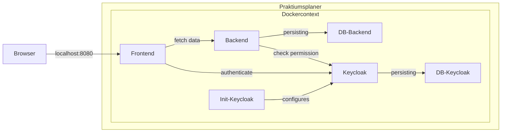
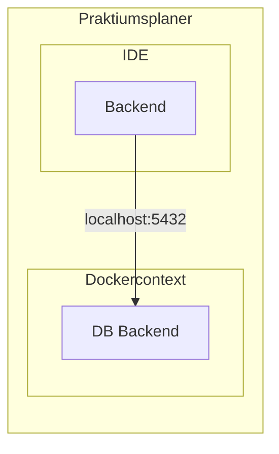

# Local Development
This page should make it easier to start developing locally.

## Prerequisites

The following programs / tools must be installed:

- Docker (to use the provided images)
 
## Stack folder
The Repository contains a `stack` folder.
In this stack folder you can find a docker compose file.
This docker compose file is configured to deploy all the necessary services
for the application.
There is also a folder with keycloak migrations and `.env` files for the different services.


### Docker Compose File
| Service           | Description                                            |
|-------------------|--------------------------------------------------------|
| pp-frontend       | The frontend if deployed                               |
| pp-backend        | The backend if deployed                                |
| postgres-backend  | Postgres Database for the application                  |
| keycloak          | Local SSO service                                      |
| init-keycloak     | Keycloak initializer to apply the keycloak migrations  |
| postgres-keycloak | Postgres Database for the keycloak service             |
| postgres-pg-admin | PgAdmin to access the database                         |
| mail-maildev      | Local Mail-Client                                      |
| mail-mailpit      | Local SMTP-Server                                      |

Use docker compose to start the infrastructure

```
# Starts the infrastructure services like keycloak and db for backend
docker compose up -d

# Starts all services
docker compose --profile full up -d

# Includes the backend service on startup
docker compose --profile backend up -d

# Includes the frontend service on startup
docker compose --profile frontend up -d
```




The frontend and Backend are only started if docker compose is run with the profile full.
If you want to develop locally it is sugessted to start docker compose without this profile
and start those parts via your IDE.
The `.env` files for the frontend and backend are used when these services are deployed.
If you start them via your IDE they are not used.

**⚠ Note**

The frontend will not start successfully at the first start.
This is because the keycloak is not yet fully set up when the frontend is started.
The setup of the keycloak is complete when the container `init-keycloak` is stopped again.
The frontend can then be started afterward.

As soon as all services except `init-*` have been started, the application can be accessed via http://localhost:8080.
For authentication, use the user `testleitung` with the password `test`.

**⚠ Proxy note**

If a proxy is set up in the browser, please make sure that it does not resolve `kubernetes.docker.internal`.


### Keycloak
An admin user and a test user are created by `init-keycloak`. You can change the configuration via the keycloak ui.

#### configuration migration
Realm, client user and other configuration should be done by the migration client. Its config files are located in
`keycloak\migration`. The main file is `keycloak-changelog.yml`. It contains the list of migration files that
should be applied. For more information check [here](https://mayope.github.io/keycloakmigration/migrations/client/).

### Postgres
#### Connection to Postgresql-DB in Docker



There is a database for the backend in the infrastructure provided.
The `db-postgres` profile must be used to connect the backend to it during development.
It is configured so that a connection to the infrastructure is established by default.


## Local Development
For Local Development you have two options. You can either start all the services with or without security features.
For the Spring Applications (Backend & ApiGateway) this is realized via profiles.
For the Vue Application (frontend) this is realized via "modes".
Usually the Frontend is packaged within the ApiGateway and the ApiGateway serves it to the user.
This process would be very time-consuming, so we implemented a way to test all the features with the vite dev server.
In the `package.json` in the scripts section we defined `security` and `serve`, where `security` starts with the 
`.env.developmentSecurity` file and `serve` starts with the `.env.development` file.

The table below shows the possible startup configurations for the different parts of the application.

| Service     | Startup                                | Behavior                                                                                                                                                                                                                                   |
|-------------|----------------------------------------|--------------------------------------------------------------------------------------------------------------------------------------------------------------------------------------------------------------------------------------------|
| Backend     | profiles=local,db-postgres,no-security | Starts the backend without security features and tries to connect to the postgres-DB provided by the local stack (Docker-Compose)                                                                                                          |
| Backend     | profiles=local,db-postgres             | Starts the backend with security features and tries to connect to the postgres-DB provided by the local stack (Docker-Compose). This needs an API-Gateway with active security to work.                                                    |
| API-Gateway | profiles=local,no-security             | Starts the API-Gateway without security features.                                                                                                                                                                                          |
| API-Gateway | profiles=local                         | Starts the API-Gateway with security features. It tries to connect to the local keycloak provided by the local stack (Docker-Compose).                                                                                                     |
| Frontend    | npm run serve                          | Starts the VUE frontend without security features active. Use this, if you want to develop new functionality fast and without need to login.                                                                                               |
| Frontend    | npm run security                       | Starts the VUE frontend with security features active. Use this, if you want to test new security restrictions or make sure a specific feature is only shown specific users. When using this you need an API-Gateway with active security. |

If you want to test the frontend with security locally you have to go to the IP of the API-Gateway first (usually `localhost:8082`).
When heading to this url you should be redirected to the keycloak login where you can login and obtain your token.
After logging in you should be able to go back to the frontend dev server (usually hosted on `localhost:8081`) and use
the app normally.