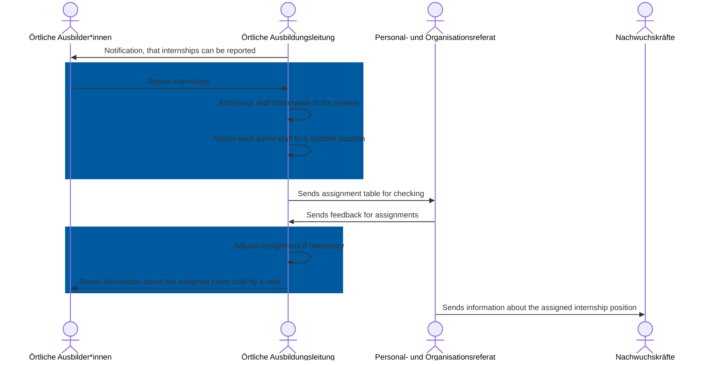

The __Praktikumsplaner__ offers a way to organize junior staff and their internships during their vocational training.

---
## About the project

The Praktikumsplaner, a project launched in collaboration between the Competence Center of Software Engineering (CCSE) and the InnovationLab, aims to support the training management in the allocation of junior staff.
It offers trainers the opportunity to report their available internships to the training management.
They can then use the application to assign junior staff to the reported internships using drag-and-drop functionality.
The internship planner helps to maintain a good overview in order to assign junior staff to the most suitable positions.

Here you can see the overall process in which the Praktikumsplaner takes place. The area marked in blue is where the Praktikumsplaner provides direct support.

---

Here you can see a screenshot of the assignment part of the application

## Technical details

The Praktikumsplaner was developed with the [reference architecture](https://opensource.muenchen.de/publish.html#refarch) of the City of Munich.
Java Spring Boot is used in the backend and TypeScript and [Vue.js](https://opensource.muenchen.de/software/vuejs.html) in the frontend.  
The application is operated in the data center of the City of Munich on [Openshift](https://opensource.muenchen.de/software/openshift.html).