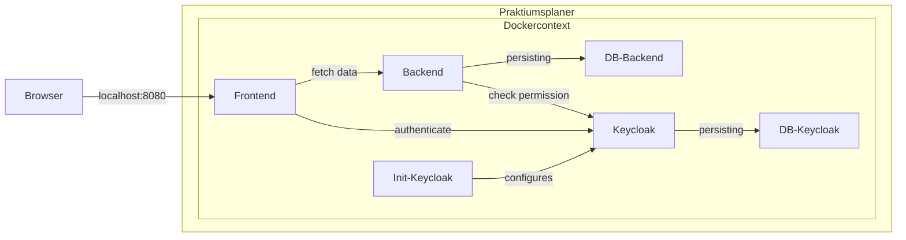
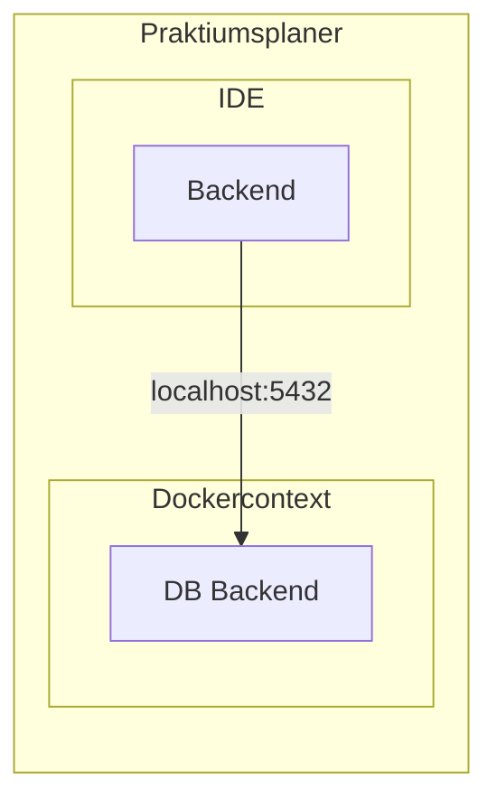

# Technical Setup

The technical setup is described below.

**Table of Contents**

[[TOC]]

## Local infrastructure

A local infrastructure for development is provided in the folder `stack`.

### Prerequisites

The following programs / tools must be installed:

- Docker (to use the provided images)

### Using the application with Docker

There is a `docker compose` file in the `stack` folder that is used to create all the necessary containers.
To use, execute the command `docker compose --profile full up -d`.

**⚠ Note**

The frontend will not start successfully at the first start.
This is because the keycloak is not yet fully set up when the frontend is started.
The setup of the keycloak is complete when the container `init-keycloak` is stopped again.
The frontend can then be started afterward.

As soon as all services except `init-*` have been started, the application can be accessed via http://localhost:8080.
For authentication, use the user `testleitung` with the password `test`.

**⚠ Proxy note**

If a proxy is set up in the browser, please make sure that it does not resolve `kubernetes.docker.internal`.

### Frontend development (in progress)

*TBD*

### Backend development (in progress)

#### Connection to Postgresql-DB in Docker

There is a database for the backend in the infrastructure provided.
The `db-postgres` profile must be used to connect the backend to it during development.
It is configured so that a connection to the infrastructure is established by default.

Using `docker compose up -d`, only the central services are started in Docker, including the required database.