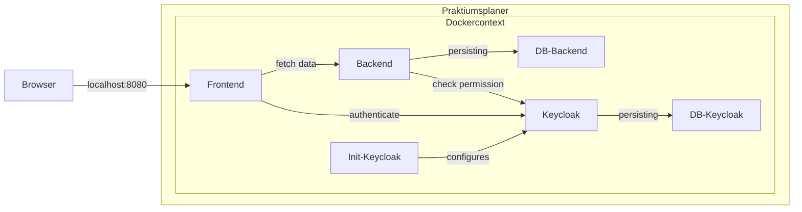
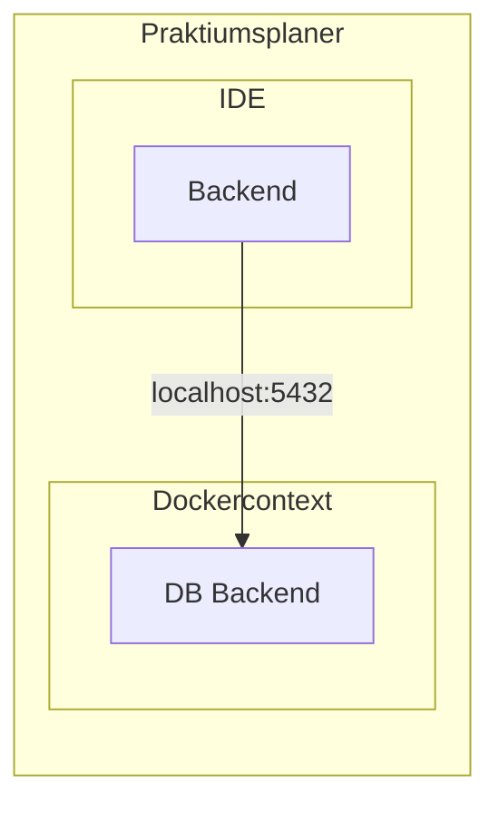

# Technisches Setup

Im Folgenden wird das technische Setup beschrieben.

**Inhaltsverzeichnis**

[[TOC]]

## lokale Infrastruktur

Für die Entwicklung wird eine lokale Infrastruktur im stack Ordner bereitgestellt.

### Voraussetzungen

Folgende Programme / Tools müssen installiert sein:

- Docker (zur Nutzung der bereitgestellten Images)

### Verwendung der Anwendung mittels Docker

Im Ordner `stack` gibt es ein `docker compose`-File über dass alle notwendigen Container aufgebaut werden.
Dazu den Befehl `docker compose --profile frontend up -d` verwenden.

**⚠ Hinweis**

Beim ersten Start wird das Frontend nicht erfolgreich mit starten. Das liegt daran dass der Keycloak noch beim Start
from Frontend noch nicht vollständig eingerichtet ist. Die Einrichtung vom Keycloak ist abgeschlossen wenn der Container
`init-keycloak``wieder gestoppt ist. Danach kann das Frontend gestartet werden.

Sobald alle Services, ausgenommen vom `init-*` gestartet sind kann auf die Anwendung via http://localhost:8080
zugegriffen werden. Zur Authentifizierung den Benutzer `testuser` mit dem Passwort `test` verwenden.

**⚠ Proxyhinweis**

Wenn im Browser ein Proxy eingerichtet ist bitte darauf achten dass dieser nicht `kubernetes.docker.internal` auflöst.

### Frontendentwicklung (in Progress)

*TBD*

### Backendentwicklung (in Progress)

#### Anbindung an Postgresql-DB in Docker

In der bereitgestellten Infrastruktur gibt es eine Datenbank für das Backend. Um das Backend bei der Entwicklung damit zu
verbinden muss das Profil `db-postgres` verwendet werden. Es ist so konfiguriert, dass standardmäßig eine Verbindung
zur Infrastruktur aufgebaut wird.
