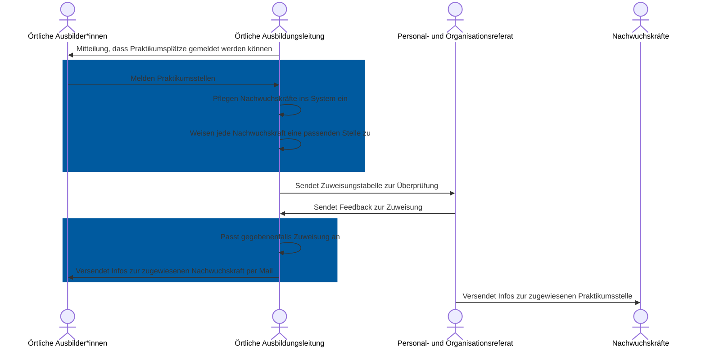

```mermaid
sequenceDiagram
    actor ÖA as Örtliche Ausbilder*innen
    actor ÖAL as Örtliche Ausbildungsleitung
    actor POR as Personal- und Organisationsreferat
    actor NWK as Nachwuchskräfte
    ÖAL->>ÖA: Mitteilung, dass Praktikumsplätze gemeldet werden können
    rect rgb(0, 90, 159)
    ÖA->>ÖAL: Melden Praktikumsstellen
    ÖAL->>ÖAL: Pflegen Nachwuchskräfte ins System ein 
    ÖAL->>ÖAL: Weisen jede Nachwuchskraft eine passenden Stelle zu
    end
    ÖAL->>POR: Sendet Zuweisungstabelle zur Überprüfung
    POR->>ÖAL: Sendet Feedback zur Zuweisung
    rect rgb(0, 90, 159)
    ÖAL->>ÖAL: Passt gegebenenfalls Zuweisung an
    ÖAL->>ÖA: Versendet Infos zur zugewiesenen Nachwuchskraft per Mail
    end
    POR ->> NWK: Versendet Infos zur zugewiesenen Praktikumsstelle
```
