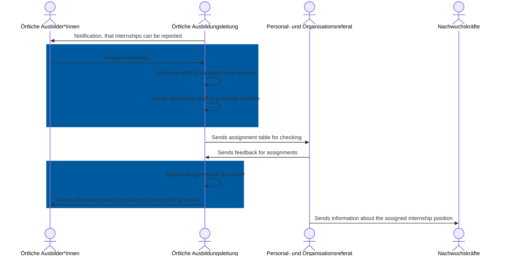

```mermaid
sequenceDiagram
    actor ÖA as Örtliche Ausbilder*innen
    actor ÖAL as Örtliche Ausbildungsleitung
    actor POR as Personal- und Organisationsreferat
    actor NWK as Nachwuchskräfte
    ÖAL->>ÖA: Notification, that internships can be reported
    rect rgb(0, 90, 159)
    ÖA->>ÖAL: Report internships
    ÖAL->>ÖAL: Add junior staff information to the system
    ÖAL->>ÖAL: Assign each junior staff to a suitable position
    end
    ÖAL->>POR: Sends assignment table for checking
    POR->>ÖAL: Sends feedback for assignments
    rect rgb(0, 90, 159)
    ÖAL->>ÖAL: Adjusts assignment if necessary
    ÖAL->>ÖA: Sends information about the assigned junior staff by e-mail
    end
    POR ->> NWK: Sends information about the assigned internship position
```
